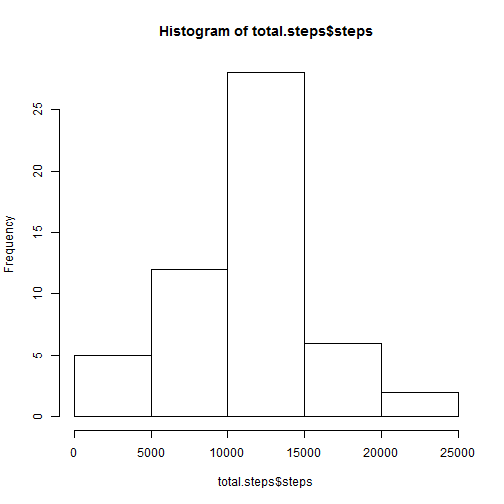
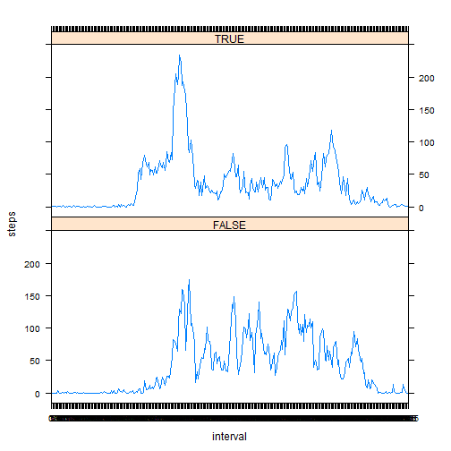

# Reproducible Research: Peer Assessment 1
This project makes use of pedometer data recorded for five minute intervals over the course of a day.  This data is acquired by forking the following github repository:  
[github.com/rdpeng/RepData_PeerAssessment1](https://github.com/rdpeng/RepData_PeerAssessment1).  
Once the repository is copied to a local drive, the following code chunks process and analyze the code. 

## Loading and preprocessing the data
This set of code sets a local drive, be sure to adjust the directory to your appropriate location.  Unzip the file to gain access to the dataset, and load it in from .csv form.  Be sure to reformat the date so that it is readable, and the interval, so R recognizes it as a factor, not an integer.


```r
setwd("C:/coursera/RepData_PeerAssessment1")
unzip("activity.zip")
activity <- read.csv("activity.csv")
activity$date <- as.Date(activity$date)
activity$interval <- as.factor(activity$interval)
```


## What is mean total number of steps taken per day?
In order to process the total steps, we need to aggregate the steps over the course of the day using a simple aggregator function.  Here aggregate plays this role, providing a summation of steps over the course of each day.  

```r
total.steps <- aggregate(steps~date, data = activity, FUN = sum, na.rm = TRUE)
hist(total.steps$steps)
```

 

```r
mean(total.steps$steps)
```

```
## [1] 10766
```

```r
median(total.steps$steps)
```

```
## [1] 10765
```
## What is the average daily activity pattern?
Now we look at the average daily activity. This begins by a similar aggregator function, changing the FUN to a mean calculation, and the split groups  to be each five minute interval.    

In order to plot the patterns as a line, we have to change the interval function to an integer class variable, as factor variables do not allow nice drawing of lines. The plot is labeled to be more readable and we can see that the interval with  the highest average steps is 8:35, most likely corresponding to a morning jog taken by this individual.   

```r
avg.daily <- aggregate(steps~interval, data = activity, FUN = mean, na.rm = TRUE)
plot(as.integer(avg.daily$interval), avg.daily$steps, type = "l",
     axes = F, xlab = "Time Interval", ylab = "Avg Steps")
  box()    
  axis(side = 1, at = c((6*12), (12*12), (18*12)), 
         label = c( "6:00", "12:00", "18:00"))
  axis(side = 2) 
```

 

```r
#time interval corresponding to max average steps
avg.daily$interval[avg.daily$steps == max(avg.daily$steps)]
```

```
## [1] 835
## 288 Levels: 0 5 10 15 20 25 30 35 40 45 50 55 100 105 110 115 120 ... 2355
```

## Imputing missing values
Since there are a significant amount of missing values, we take the average for that interval, and replace the missing steps with the interval's average.  Note that there are 2304 NA's, we strip out just the NA values, merge the avg.daily steps into it, then rbind that to the original dataset purged of the NA values.   

The new Histogram is virtually unchanged from the previous example, however our median computation increases by one step.  This suggests that there is virtually no bias by omitting the NA values


```r
#count NA values
sum(is.na(activity))
```

```
## [1] 2304
```

```r
#replace NA values w/ interval avg 
index.na <- is.na(activity$steps)
replace <- activity[index.na,] 
replace <- replace[, c("interval", "date")]
replace <- merge(replace, avg.daily, by = "interval", all.x = TRUE)

#Check new total daily steps
complete.activity <- rbind(activity[!index.na,], replace)
new.total.steps <- aggregate(steps~date, data = complete.activity
                             , FUN = sum, na.rm = TRUE)
hist(new.total.steps$steps)
```

 

```r
mean(new.total.steps$steps)
```

```
## [1] 10766
```

```r
median(new.total.steps$steps)
```

```
## [1] 10766
```
## Are there differences in activity patterns between weekdays and weekends?


```r
activity$weekday <- as.factor(!(weekdays(activity$date) %in% c("Saturday", "Sunday")))
activity$weekend <- as.factor(weekdays(activity$date) %in% c("Saturday", "Sunday")) 
require(lattice)
```

```
## Loading required package: lattice
```

```r
weekday.split.avg <- aggregate(steps ~ interval + weekday, 
          data = activity, FUN = mean, na.rm = TRUE)

xyplot(steps~interval | weekday, data = weekday.split.avg,
       type = "l", 
       layout=c(1,2))
```

 
